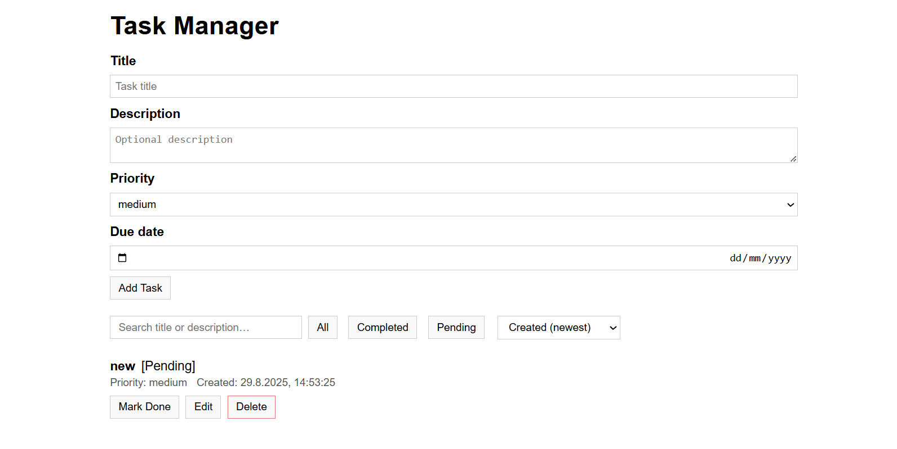

# Task Manager App

Simple task manager built with React (frontend) and Express.js (backend).  
Supports creating, viewing, updating, deleting, and toggling tasks.  
Data is stored in memory (no database).

## Setup

### Backend
```bash
cd backend
npm install
npm start   # runs on http://localhost:4000
```

### Frontend
```bash
cd frontend
npm install
npm run dev # runs on http://localhost:5173
```

## API Endpoints
- `GET /api/tasks` – get all tasks  
- `POST /api/tasks` – create new task  
- `PUT /api/tasks/:id` – update task  
- `DELETE /api/tasks/:id` – delete task  
- `PATCH /api/tasks/:id/toggle` – toggle completion

## Features
- One task displayed at a time in an endless carousel
- Add / Edit / Delete / Toggle tasks
- Filter: All / Completed / Pending
- Priority: low / medium / high
- Basic input validation and error handling

## Screenshot

